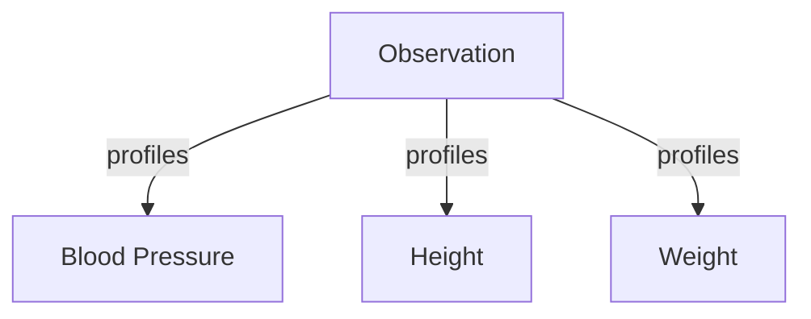
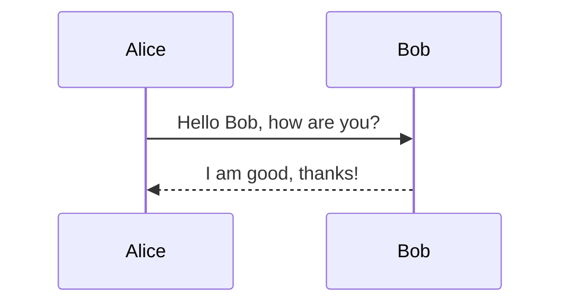
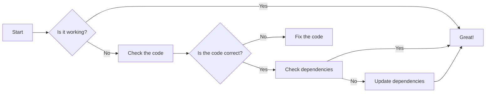
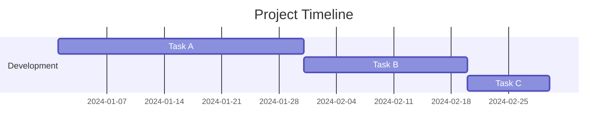
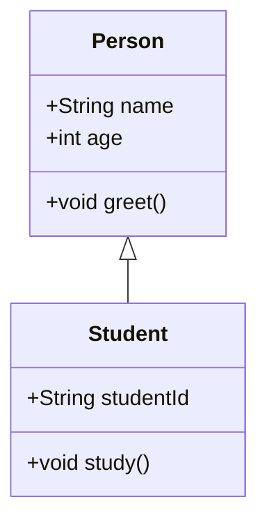
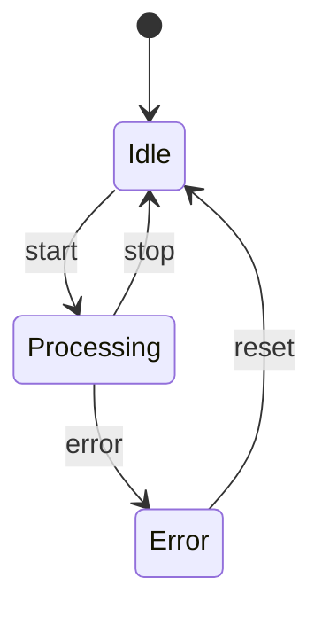
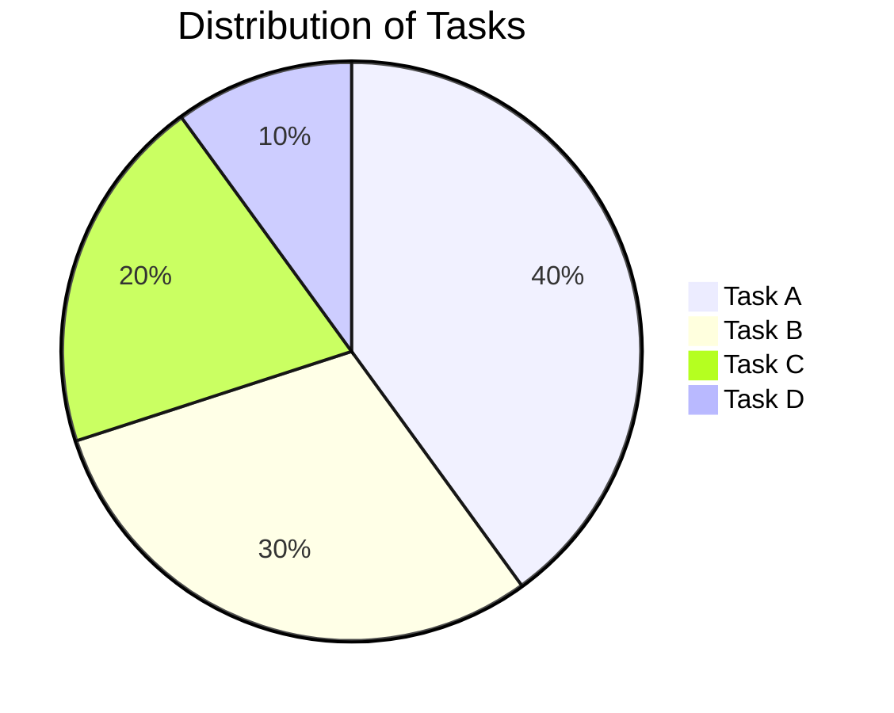
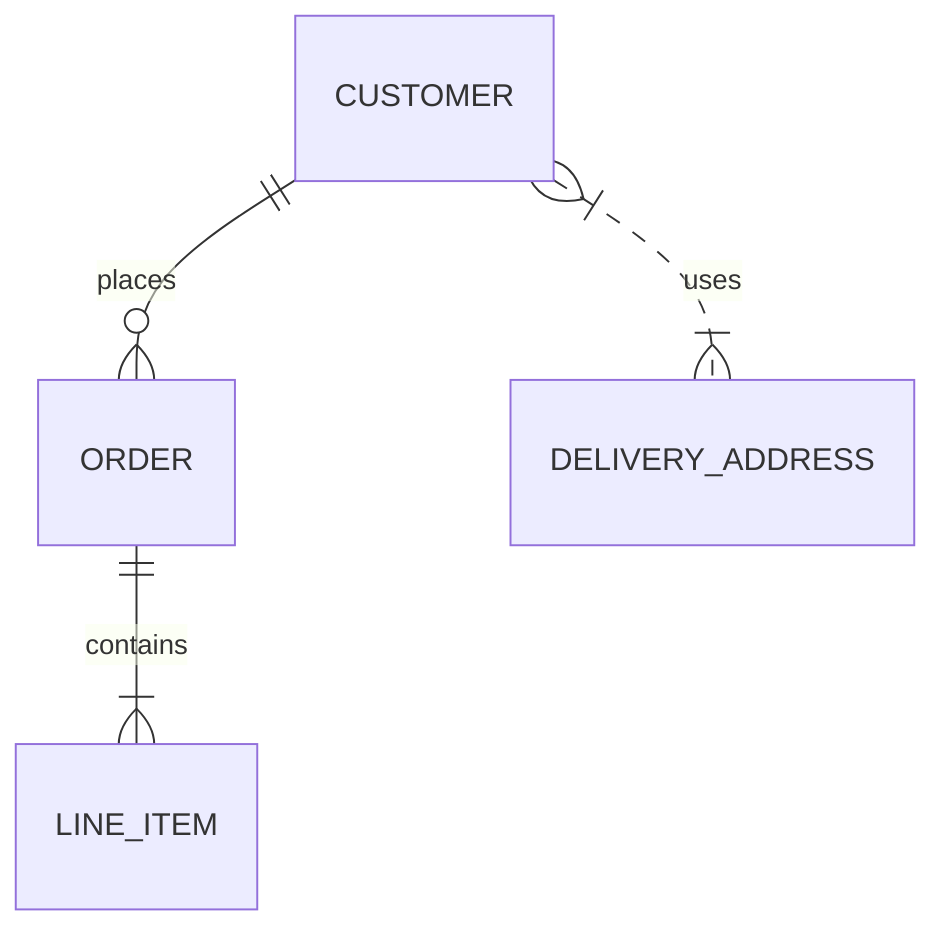
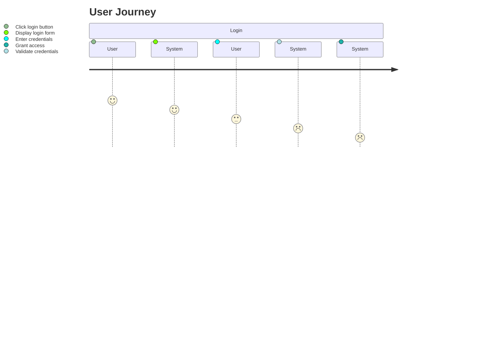
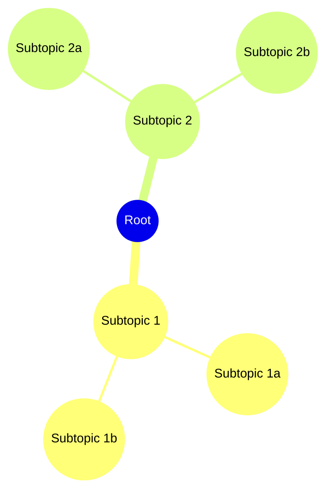

Show a Mermaid diagrams.

### Mermaid Diagrams

#### Simple Mermaid Diagram

#### Sequence Diagram

#### Flowchart

#### Gantt Chart

#### Class Diagram

#### State Diagram

#### Pie Chart

##### Entity Relationship Diagram

#### User Journey Diagram

#### Mind Map

### Plantuml Diagrams

#### Simple Plantuml Diagram



#### Plantuml Sequence Diagram



#### Plantuml Flowchart



#### Plantuml Gantt Chart

not supported by Plantuml, but can be created using Mermaid as shown above.

#### Plantuml Class Diagram



#### Plantuml State Diagram



#### Plantuml Pie Chart



#### Plantuml Entity Relationship Diagram



#### Plantuml User Journey Diagram



#### Plantuml Mind Map



### Source

The source code for this Implementation Guide can be found on [GitHub](https://github.com/JohnMoehrke/testMermaid)

#### Cross Version Analysis



#### Dependency Table



#### Globals Table



#### IP Statements


