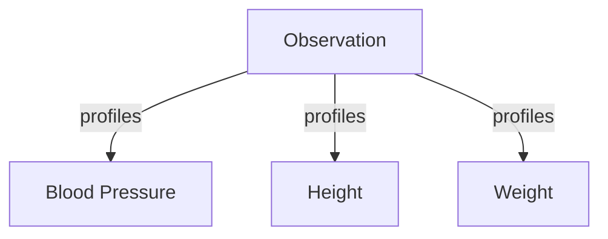

Show a simple Mermaid diagram.

### Source

The source code for this Implementation Guide can be found on [GitHub](https://github.com/JohnMoehrke/testMermaid)

#### Cross Version Analysis



#### Dependency Table



#### Globals Table



#### IP Statements


